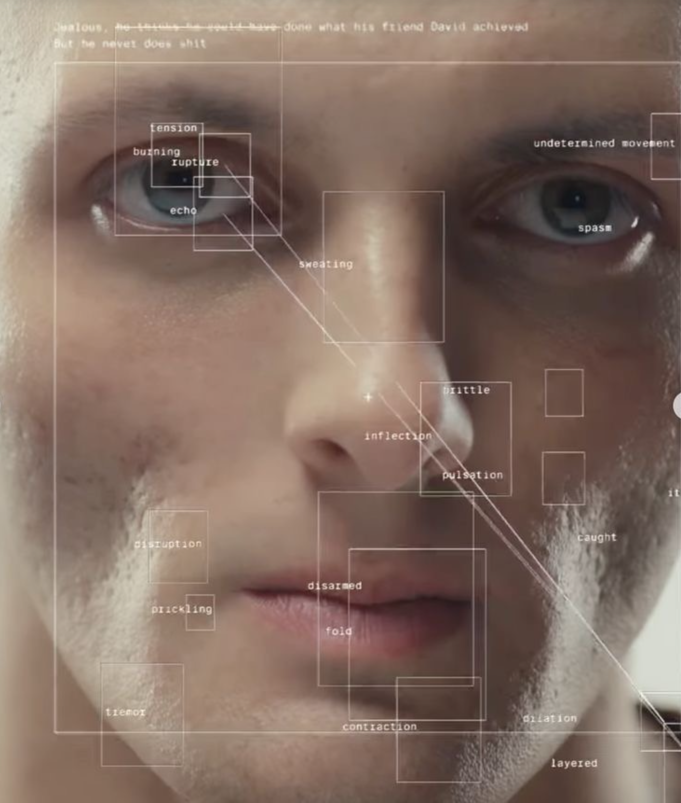

# Emo Viz Prototype

Quick prototype workspace for the CSMA / ACSM Emo Viz entrance concept.

## Concept

The attached proposal reframes the museum entrance AI wall as an introduction to the Emo Viz. Instead of placing the Prompt Lab at the entrance, the wall becomes a short passive interaction:

- Ask visitors: "How do you feel about the future of AI?"
- Use a live camera feed to detect a face and facial expression.
- Show a diagnostic-style overlay on top of the camera image.
- Map the detected expression to a public-facing sentiment such as Curious, Excited, Thoughtful, Concerned, Anxious, Resistant, or Distrustful.
- Optionally drive the LED mesh with sentiment-specific colour behaviours.

Reference visual target:



## Prototype Goal

Build a fast local demo that proves the visitor-facing moment:

1. A live camera feed appears on the primary screen.
2. Face detection locks onto the visitor.
3. Emotion/sentiment labels and translucent bounding boxes appear over the face.
4. The dominant expression is translated into an Emo Viz sentiment line.
5. A simulated LED panel or secondary visual state changes colour based on that sentiment.

## Architecture And Models

The prototype is split into a static React frontend and a local Python vision backend.

| Layer | Implementation | Notes |
|---|---|---|
| Frontend | React + Vite + JavaScript/JSX | Runs the camera view, overlay canvas, diagnostics panel, sentiment mapping, and LED mesh simulation. |
| Camera | Browser `getUserMedia` | Uses the local webcam; the default view is mirrored for visitor-facing interaction. |
| Feature placement | Python OpenCV YuNet (`face_detection_yunet_2023mar.onnx`) | Fixed live path. Receives downscaled full-frame JPEGs at `/detect`, detects multiple faces, and returns face boxes plus eye, nose, mouth, and brow landmarks. |
| Emotion analysis | Python OpenCV FER+ (`emotion-ferplus-8.onnx`) | Receives `192x192` face crops at `/analyze`. The default mode is `Python FER+ + YuNet assist`; `Python FER+ raw` remains available as the baseline. |
| Sadness assist | YuNet landmark geometry | Uses crop-relative mouth/eye/nose landmarks to reduce FER+'s neutral bias on downturned-mouth sad expressions. |
| Hosting | Firebase Hosting | Publishes the static frontend at `https://emo-viz.web.app`. |
| Backend hosting | Cloud Run or local Python service | Public demos use the Cloud Run HTTPS backend. Local installs can run the same Python backend on the exhibit machine for TouchDesigner/OSC output. |
| TouchDesigner output | OSC over UDP | Optional local output from the Python backend to TouchDesigner `OSC In CHOP`. Disabled by default and enabled with `OSC_ENABLED=1`. |

Keep local model weights in `/Users/ro/Desktop/KR+D/local-models/` or a `KRD_LOCAL_MODELS_DIR` override. Do not download model binaries into this project folder.

## Environment URLs

| Environment | URL | Notes |
|---|---|---|
| GCP/Firebase project | `emo-viz` | Sole active cloud project for the prototype; previous `ai-emotion-krd` project was decommissioned after migration. |
| Staging web app | `https://emo-viz.web.app` | Firebase Hosting site for the public Emo Viz prototype. |
| Staging backend API | `https://emo-viz-backend-n2iej5lfpq-as.a.run.app` | Cloud Run HTTPS backend used by the Firebase build. |
| GitHub repository | `https://github.com/Kingsmen-Almaty/emo-viz-prototype` | Nested CSMA prototype repo. |
| Local web app | `http://127.0.0.1:5178/` | MacBook camera testing via `pnpm dev --port 5178`. |
| Local backend API | `http://127.0.0.1:8787/` | Python YuNet/FER+ service via `pnpm backend`. |
| Local TouchDesigner OSC | `udp://127.0.0.1:9000` | Optional OSC output when `OSC_ENABLED=1`. |

## Files

| Path | Purpose |
|---|---|
| `docs/implementation-plan.md` | Detailed build plan and technical architecture. |
| `docs/proposal-summary.md` | Source-grounded summary of the attached proposal. |
| `DECISIONS.md` | Prototype decisions and constraints. |
| `assets/reference/` | Reference imagery supplied for the overlay treatment. |

## Run Locally

```bash
pnpm install
pnpm dev --port 5178
```

Open `http://127.0.0.1:5178/` for real MacBook camera testing.

Open `http://127.0.0.1:5178/?mode=test` for the deterministic fake camera feed used by Playwright.

For the local backend feature-placement and emotion paths, run the Python service in a second terminal:

```bash
pnpm backend
```

Feature placement is fixed to `Python YuNet multi-face`. The frontend sends a downscaled full-frame JPEG to `http://127.0.0.1:8787/detect`, and the backend returns multiple face boxes plus eye, nose, mouth, and brow landmarks for overlay placement.

For emotion analysis, use the side panel to switch between `Python FER+ + YuNet assist` and `Python FER+ raw`. The frontend sends a small `192x192` JPEG face crop to `http://127.0.0.1:8787/analyze` roughly once every 700ms, and the backend runs the FER+ ONNX model locally through OpenCV DNN.

Set `VITE_BACKEND_URL` when the Python backend is hosted somewhere other than the local workstation:

```bash
VITE_BACKEND_URL=https://your-backend.example.com pnpm build
```

Current hosted backend:

```txt
https://emo-viz-backend-n2iej5lfpq-as.a.run.app
```

## Local JSON API

The Python backend exposes POST endpoints for inference and GET endpoints for polling raw latest values from another system such as TouchDesigner, Unity, an LED controller, or a second display.

The GET endpoints do not run new inference and do not return the Emo Viz sentiment copy such as `Excited` or `Concerned`. They are lightweight raw-data taps that return the most recent YuNet feature-placement payload and FER+ emotion payload generated by the live camera pipeline. External apps can poll them without sending images.

| Method | Path | Purpose |
|---|---|---|
| `GET` | `/health` | Backend status, model readiness, and endpoint list. |
| `POST` | `/detect` | Runs YuNet on a full-frame JPEG and updates the latest feature-placement result. |
| `GET` | `/feature-placement` | Returns the latest raw YuNet feature-placement result, including detected faces, boxes, landmarks, frame size, and `updatedAt`. |
| `POST` | `/analyze` | Runs FER+ on a face crop and updates the latest emotion result. |
| `GET` | `/emotion` | Returns the latest raw FER+ emotion result, including normalized expressions, raw FER+ metrics, assist metrics, and `updatedAt`. |

Fresh backend sessions return `status: "empty"` on the GET endpoints until the browser or another client has posted at least one frame/crop.

Hosted Cloud Run API URLs:

```txt
GET  https://emo-viz-backend-n2iej5lfpq-as.a.run.app/health
GET  https://emo-viz-backend-n2iej5lfpq-as.a.run.app/feature-placement
GET  https://emo-viz-backend-n2iej5lfpq-as.a.run.app/emotion
POST https://emo-viz-backend-n2iej5lfpq-as.a.run.app/detect
POST https://emo-viz-backend-n2iej5lfpq-as.a.run.app/analyze
```

Local API URLs:

```txt
GET  http://127.0.0.1:8787/health
GET  http://127.0.0.1:8787/feature-placement
GET  http://127.0.0.1:8787/emotion
POST http://127.0.0.1:8787/detect
POST http://127.0.0.1:8787/analyze
```

Feature-placement GET shape:

```json
{
  "ok": true,
  "status": "ready",
  "updatedAt": 1719200000000,
  "engine": "opencv-yunet",
  "faces": [
    {
      "id": "yunet-0",
      "x": 312.5,
      "y": 120.25,
      "width": 210.4,
      "height": 246.8,
      "confidence": 0.94,
      "landmarks": {
        "leftEye": { "x": 370.2, "y": 210.4 },
        "rightEye": { "x": 455.1, "y": 211.0 },
        "nose": { "x": 413.9, "y": 265.5 },
        "mouth": { "x": 414.0, "y": 318.2 },
        "brow": { "x": 412.6, "y": 180.8 },
        "leftMouth": { "x": 386.2, "y": 318.1 },
        "rightMouth": { "x": 441.8, "y": 318.3 }
      }
    }
  ],
  "frame": { "width": 640, "height": 360 }
}
```

Emotion GET shape:

```json
{
  "ok": true,
  "status": "ready",
  "updatedAt": 1719200000000,
  "engine": "opencv-ferplus-yunet-assist",
  "expressions": {
    "happy": 0.04,
    "surprise": 0.03,
    "neutral": 0.12,
    "sad": 0.68,
    "fear": 0.04,
    "angry": 0.08,
    "disgust": 0.01
  },
  "metrics": {
    "model": "emotion-ferplus-8",
    "mode": "ferplus-assisted",
    "input": "64x64-grayscale",
    "sadAssist": 0.42,
    "raw": {
      "neutral": 0.71,
      "happiness": 0.01,
      "surprise": 0.02,
      "sadness": 0.18,
      "anger": 0.06,
      "disgust": 0,
      "fear": 0.01,
      "contempt": 0.01
    }
  }
}
```

## Firebase Hosting

The Firebase Hosting target is configured for project ID `emo-viz`, site ID `emo-viz`, and display name `Emo Viz`.

```bash
pnpm build
pnpm run deploy:firebase
```

Firebase Hosting publishes the static React app from `dist/`. The Python YuNet/FER+ backend is separate from Hosting; for a public web demo, deploy that backend to Cloud Run or Firebase Functions and rebuild with `VITE_BACKEND_URL` set to the deployed backend URL.

For the current public web demo:

```bash
VITE_BACKEND_URL=https://emo-viz-backend-n2iej5lfpq-as.a.run.app pnpm run deploy:firebase
```

## Cloud Run Backend

The backend is deployed as a Cloud Run service in project `emo-viz`, region `asia-southeast1`.

```bash
gcloud run deploy emo-viz-backend \
  --source backend \
  --project=emo-viz \
  --region=asia-southeast1 \
  --allow-unauthenticated \
  --memory=1Gi \
  --cpu=1 \
  --timeout=60
```

Cloud Run uses HTTPS and is the correct backend target for browsers opening the Firebase-hosted web app from other machines. The Cloud Run container downloads YuNet and FER+ into `/tmp/krd-local-models` at runtime; local development still uses `/Users/ro/Desktop/KR+D/local-models/` unless `KRD_LOCAL_MODELS_DIR` is set.

## TouchDesigner OSC

For TouchDesigner, run the Python backend locally on the same machine as TouchDesigner or on the same LAN. Cloud Run should not be used for OSC because UDP packets need to reach the TouchDesigner workstation directly.

Install backend dependencies, then start the backend with OSC enabled:

```bash
python3 -m pip install -r backend/requirements.txt
OSC_ENABLED=1 OSC_HOST=127.0.0.1 OSC_PORT=9000 pnpm backend
```

If TouchDesigner is on another machine, replace `OSC_HOST` with that machine's LAN IP:

```bash
OSC_ENABLED=1 OSC_HOST=192.168.1.50 OSC_PORT=9000 pnpm backend
```

TouchDesigner setup:

| TouchDesigner node | Setting |
|---|---|
| `OSC In CHOP` | Network Port `9000` |
| Protocol | UDP |
| Address scope | `/emoViz/...` |
| Channel usage | Use normalized `0.0-1.0` box and landmark channels directly in CHOP networks. |

Core OSC channels:

```txt
/emoViz/status/active
/emoViz/status/faces
/emoViz/status/timestamp
/emoViz/face/0/active
/emoViz/face/0/confidence
/emoViz/face/0/box/x
/emoViz/face/0/box/y
/emoViz/face/0/box/w
/emoViz/face/0/box/h
/emoViz/face/0/landmark/leftEye/x
/emoViz/face/0/landmark/leftEye/y
/emoViz/face/0/landmark/rightEye/x
/emoViz/face/0/landmark/rightEye/y
/emoViz/face/0/landmark/nose/x
/emoViz/face/0/landmark/nose/y
/emoViz/face/0/landmark/mouth/x
/emoViz/face/0/landmark/mouth/y
/emoViz/face/0/landmark/brow/x
/emoViz/face/0/landmark/brow/y
/emoViz/face/0/emotion/neutral
/emoViz/face/0/emotion/happy
/emoViz/face/0/emotion/surprise
/emoViz/face/0/emotion/sad
/emoViz/face/0/emotion/fear
/emoViz/face/0/emotion/angry
/emoViz/face/0/emotion/disgust
/emoViz/face/0/emotion/dominantId
/emoViz/face/0/emotion/confidence
```

Emotion IDs:

| ID | Emotion |
|---:|---|
| `0` | neutral |
| `1` | happy |
| `2` | surprise |
| `3` | sad |
| `4` | fear |
| `5` | angry |
| `6` | disgust |

Feature channels support fixed face slots from `0` to `OSC_MAX_FACES - 1` so TouchDesigner channel networks stay stable as faces enter and leave. The default `OSC_MAX_FACES` is `6`.

## Verification

```bash
pnpm build
pnpm test:e2e
```

Model binaries and generated build output should not be committed. YuNet and FER+ weights are loaded by the Python backend from the shared KR+D model store.

The Playwright suite checks:

- Desktop and kiosk viewport rendering.
- Test camera feed, overlay canvas, sentiment result, diagnostics, and LED simulator.
- Screenshot pixel variance so the stage is not blank.
- Chromium fake-camera boot path with the local Python model path.
- Backend sample generation, backend YuNet multi-face placement, and the two Python emotion modes.

## Prototype Status

Runnable React/Vite prototype with camera feed, sentiment overlay, diagnostics panel, LED simulator, backend YuNet multi-face placement, backend face-crop sampling, a lightweight local Python emotion service, Firebase Hosting config, and Playwright coverage.
