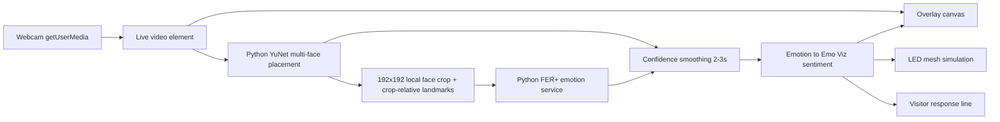

# Emo Viz Facial Sentiment Overlay Prototype Plan

## Prototype Outcome

Create a local demo for the AI Wall where a live camera feed is styled like the supplied reference image: close-up face framing, translucent diagnostic boxes, thin tracking lines, and small text labels that suggest what the AI is reading from facial expression and micro-movement.

The prototype should prove the experience and visual language first. It does not need production-grade accuracy, visitor data storage, or real LED hardware in the first pass.

## Recommended Phase 1 Architecture



## Model Options

| Option | Fit | Notes |
|---|---|---|
| MediaPipe Face Landmarker + simple expression heuristics | Removed from live UI | Tested as an option, but was less stable for the current camera/demo framing. |
| face-api.js | Removed from live UI | Useful for browser-only experiments, but the current prototype uses Python YuNet for more reliable placement. |
| Hugging Face Transformers.js emotion model | Removed from live UI | Kept out of the final demo path to reduce ambiguity while tuning FER+ results. |
| Hugging Face Inference API | Fastest model integration if internet is allowed | Good for quick proof, but less suitable for an offline museum kiosk. Avoid sending visitor images to cloud unless explicitly approved. |
| Gemma via Ollama or local inference | Best as response-text layer, not emotion detection | Gemma can turn detected sentiment into short child-friendly copy, but it should not be the primary facial-emotion detector. |
| Python OpenCV YuNet backend from downscaled full frames | Fixed live feature-placement path | Detects multiple faces and returns bbox plus eye/nose/mouth landmarks before emotion analysis. Better for far faces and multi-person scenes than browser-only feature placement. |
| Local Python FER+ backend from browser face crops | Current local emotion path | Keep the live overlay in React, send small local crops to Python, and run the FER+ ONNX model through OpenCV DNN without adding Torch or cloud inference. The assisted mode uses crop-relative YuNet landmarks to reduce FER+'s neutral bias on sad expressions. |

Recommended live-demo build: use fixed `Python YuNet multi-face` for feature placement, default to `Python FER+ + YuNet assist` for emotion analysis, keep `Python FER+ raw` as the comparison baseline, then optionally use Gemma/Hugging Face later for generated one-line response copy.

## Interface Layout

Primary 55-inch display:

- Full-screen mirrored live camera feed.
- Canvas overlay aligned exactly to the video dimensions.
- White / soft-cyan diagnostic boxes around eyes, mouth, nose bridge, brow, and face region.
- Short labels near tracked regions: `tension`, `spark`, `focus`, `pulse`, `curious`, `thoughtful`, `expression confidence`.
- One clear visitor-facing result, for example: `You seem Curious about the future of AI.`
- Avoid making the overlay look like a medical or security judgement. Keep it poetic and educational.

Secondary 32-inch display or side panel:

- Raw emotion confidence bars: Joy, Surprise, Neutral, Sadness, Fear, Anger, Disgust.
- Mapped sentiment and LED colour state.
- Detection confidence and smoothing timer for prototype debugging.

LED simulation:

- A low-res grid beside or behind the camera feed.
- Sentiment-specific colour and animation from the proposal.
- Later replace the simulator with Art-Net / sACN / DMX output if the physical LED mesh is available.

## Detection And State Flow

1. `idle`: no face detected; show ambient prompt and neutral LED breathing.
2. `tracking`: face detected; draw large face box and landmark hints.
3. `reading`: stable face confidence for 2-3 seconds; accumulate expression scores.
4. `result`: choose dominant expression, map it to visitor-facing sentiment, hold for 5-8 seconds.
5. `reset`: face lost or result timer ends; fade to idle over 2-3 seconds.

## Emotion Mapping

```js
export const sentimentMap = {
  happy: { label: 'Excited', colour: 'gold', pattern: 'bloom' },
  surprised: { label: 'Curious', colour: 'cyan-magenta', pattern: 'expanding-pulse' },
  neutral: { label: 'Thoughtful', colour: 'cool-blue-white', pattern: 'breathing-gradient' },
  sad: { label: 'Concerned', colour: 'muted-blue', pattern: 'downward-fade' },
  fearful: { label: 'Anxious', colour: 'violet-cyan', pattern: 'soft-shimmer' },
  angry: { label: 'Resistant', colour: 'crimson-orange', pattern: 'heavy-pulse' },
  disgusted: { label: 'Distrustful', colour: 'green-amber', pattern: 'broken-fade' },
};
```

## Folder Structure For App Scaffold

When ready to build the app, scaffold:

```text
emo-viz-prototype/
  package.json
  index.html
  src/
    App.jsx
    components/
      camera-feed/
      sentiment-overlay/
      sentiment-result/
      led-simulator/
      diagnostics-panel/
    lib/
      backend-url.js
      expression-adjustments.js
      face-sampler.js
      sentiment-map.js
      smoothing.js
    styles/
      tokens.css
      global.css
  backend/
    emotion_server.py
```

## Privacy And Safety

- Do not record, upload, or store visitor images in the prototype.
- If cloud inference is tested, use only staged consent and non-public demo subjects.
- Keep all processing local for the museum-ready direction unless the client explicitly approves cloud processing.
- Present results as a playful AI guess, not a factual emotional diagnosis.
- Add an on-screen note in production that the AI estimate is approximate and no images are stored.

## Implementation Tasks

1. [x] Scaffold React + Vite app in this folder.
2. [x] Add camera permission and full-screen video feed.
3. [x] Add canvas overlay and responsive coordinate mapping.
4. [x] Integrate a local face/emotion detector.
5. [x] Add 2-3 second score smoothing to prevent jitter.
6. [x] Implement sentiment mapping from proposal categories.
7. [x] Build diagnostic overlay treatment based on the reference image.
8. [x] Build LED simulator with proposal colour behaviours.
9. [x] Add secondary debug/calculation view.
10. [x] Test desktop/kiosk viewport rendering with Playwright.
11. [x] Prepare for actual MacBook Pro camera testing with auto-prepared local model files and a user test guide.
12. [x] Add a small local face-crop sampling path for backend emotion analysis.
13. [x] Add Python FER+ emotion backend modes for raw and YuNet-assisted analysis.
14. [x] Add backend YuNet multi-face placement from downscaled full-frame camera samples.
15. [x] Publish the static React frontend to Firebase Hosting.
16. [x] Deploy the Python YuNet/FER+ backend to Cloud Run for public web access.
17. [x] Add optional OSC-over-UDP output for TouchDesigner local integration.

## Acceptance Criteria

| Area | Criteria |
|---|---|
| Camera | Live feed starts after permission and fills the display without distortion. |
| Detection | Face box appears within 1 second under normal lighting. |
| Overlay | Boxes and labels stay aligned with the face as the visitor moves. |
| Smoothing | Result does not flicker between emotions frame-by-frame. |
| Sentiment | Raw emotion maps to the proposal's visitor-facing sentiment wording. |
| Reset | Installation returns to idle state when the visitor leaves. |
| Privacy | No visitor image is stored or uploaded by default. |
| Model storage | Any local weights are outside the project folder under `local-models/`. |

Backend implementation note: `pnpm backend` starts `backend/emotion_server.py` on `http://127.0.0.1:8787`. The browser sends a downscaled full-frame JPEG to `/detect` for fixed `Python YuNet multi-face` placement, and sends a local `192x192` JPEG face crop plus crop-relative landmarks to `/analyze` for `Python FER+ + YuNet assist` or `Python FER+ raw`. External apps can poll `GET /feature-placement` and `GET /emotion` for raw latest values without sending images; these GET routes return the most recent YuNet and FER+ payloads and do not run new inference or return visitor-facing sentiment copy. YuNet and FER+ ONNX models are stored in `/Users/ro/Desktop/KR+D/local-models/opencv/` or `KRD_LOCAL_MODELS_DIR`, not inside the repo. Cloud Run uses `/tmp/krd-local-models` at runtime.

Firebase Hosting note: the static frontend is published at `https://emo-viz.web.app` under Firebase project ID `emo-viz` with display name `Emo Viz`. The public backend is Cloud Run service `emo-viz-backend` in `asia-southeast1` at `https://emo-viz-backend-n2iej5lfpq-as.a.run.app`; deploy Firebase with `VITE_BACKEND_URL=https://emo-viz-backend-n2iej5lfpq-as.a.run.app pnpm run deploy:firebase`.

TouchDesigner note: enable local OSC with `OSC_ENABLED=1 OSC_HOST=127.0.0.1 OSC_PORT=9000 pnpm backend`, then use TouchDesigner `OSC In CHOP` on port `9000`. OSC uses prefix `/emoViz`, fixed face slots, normalized `0.0-1.0` coordinates, and emotion channels such as `/emoViz/face/0/emotion/happy`.

## User Testing Readiness Gate

Ready for MacBook Pro user testing when:

- `pnpm build` passes.
- `pnpm test:e2e` passes.
- `pnpm dev --port 5178` serves `http://127.0.0.1:5178/`.
- Opening the real-camera URL shows `camera-live` after browser camera permission is granted.
- Opening the real-camera URL shows `python-local`.

Current evidence: build passes, Playwright passes in desktop/kiosk/test-feed modes, Playwright fake-camera mode confirms the app reaches `camera-live` and `python-local`, and Firebase Hosting returns HTTP 200 at `https://emo-viz.web.app`.

Backend test evidence should include `pnpm backend`, `curl http://127.0.0.1:8787/health`, `curl https://emo-viz-backend-n2iej5lfpq-as.a.run.app/health`, a live-browser check that `Python YuNet multi-face` updates the face count, and a live-browser check that the backend sample panel updates while comparing `Python FER+ + YuNet assist` with `Python FER+ raw`. TouchDesigner evidence should include `OSC_ENABLED=1 ... pnpm backend` and visible `/emoViz/...` channels in `OSC In CHOP`.

## Open Questions

- Is the prototype expected to drive a physical LED mesh during the first demo, or only simulate it?
- Will the camera feed be shown mirrored to match visitor expectations?
- Is internet access allowed for the prototype demo, or must all inference be offline?
- Should the copy be English-only for the first prototype, or include Kazakh and Russian UI strings from the start?
- Should the final entrance version show the raw camera feed, or a stylised / privacy-preserving processed image?
